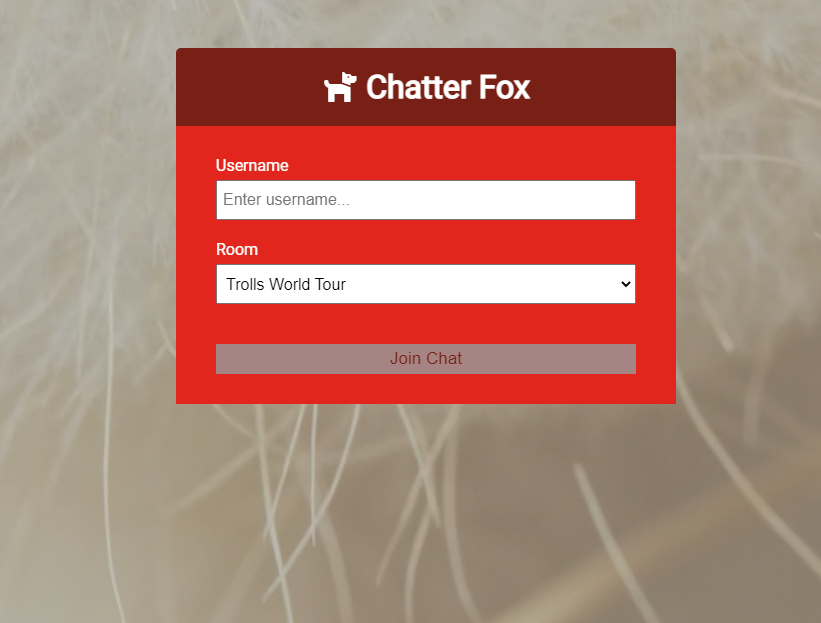
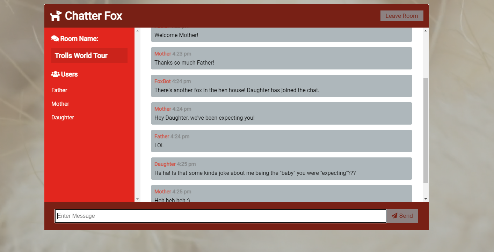

# Chatter Fox
Simple chat app, using node and socket io.

## The Challenge

Create a simple chat app that utilizes sockets for real-time to learn the fundamentals of Socket.io. Use app to pass the time with family during pandemic lockdown.  App should allow family members logging into different devices, the ability to connect and pretend that we are not all trapped under the same roof together. :wink:

### CHALLENGE ACCEPTED!

https://chatter-fox.herokuapp.com/

     

### Future Plans

- allow for users to add their own rooms dynamically
- allow users to customize each chat room based on theme
- use React for frontend
- use Flutter for mobile deployment
- create different color chat bubbles for users
- include the use of emojis in chat